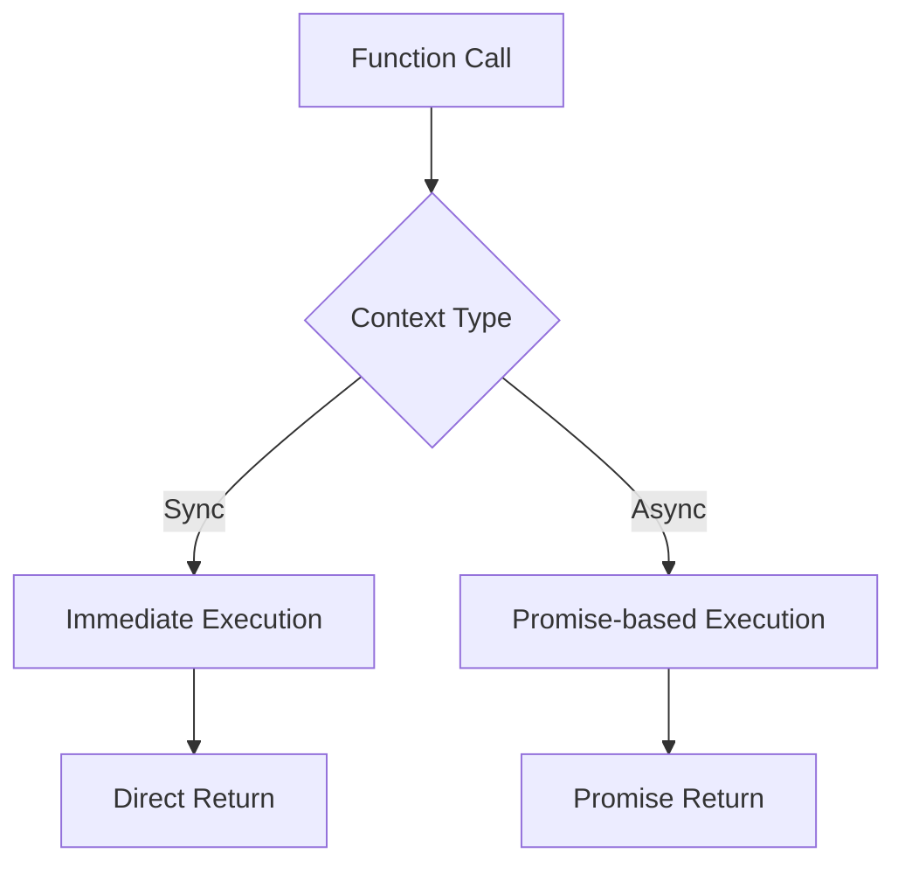

# Context Management in Quansync

This guide explains how to effectively manage and work with execution contexts in Quansync.

## Table of Contents
- [Understanding Contexts](#understanding-contexts)
- [Context Detection](#context-detection)
- [Context-Aware Programming](#context-aware-programming)
- [Best Practices](#best-practices)
- [Common Patterns](#common-patterns)
- [Troubleshooting](#troubleshooting)

## Understanding Contexts

Quansync operates in two distinct contexts:

1. **Synchronous Context**: Direct execution with immediate results
2. **Asynchronous Context**: Promise-based execution with deferred results



## Context Detection

### Using getIsAsync

```typescript
import { getIsAsync, quansync } from 'quansync'

const contextAwareFunction = quansync(function* () {
  const isAsync = yield* getIsAsync()
  console.log(`Running in ${isAsync ? 'async' : 'sync'} mode`)
  
  return isAsync ? 'async result' : 'sync result'
})
```

### Context Check Patterns

```typescript
const smartOperation = quansync(function* () {
  if (yield* getIsAsync()) {
    // Async-specific optimizations
    return yield* asyncOptimizedPath()
  } else {
    // Sync-specific optimizations
    return yield* syncOptimizedPath()
  }
})
```

## Context-Aware Programming

### Resource Management

```typescript
const withResource = quansync(function* () {
  const isAsync = yield* getIsAsync()
  const resource = yield* acquire()
  
  try {
    if (isAsync) {
      // Use streaming or batched processing
      return yield* streamProcess(resource)
    } else {
      // Use direct processing
      return yield* directProcess(resource)
    }
  } finally {
    yield* release(resource)
  }
})
```

### Performance Optimization

```typescript
const optimizedBulkProcess = quansync(function* (items: any[]) {
  const isAsync = yield* getIsAsync()
  
  if (isAsync && items.length > 100) {
    // Process in parallel chunks when async
    const chunks = chunkArray(items, 25)
    const results = []
    
    for (const chunk of chunks) {
      const chunkResults = yield* quansync(
        Promise.all(chunk.map(item => process.async(item)))
      )
      results.push(...chunkResults)
    }
    
    return results
  } else {
    // Process sequentially when sync or small dataset
    return items.map(item => yield* process(item))
  }
})
```

### Error Handling

```typescript
const contextAwareErrorHandler = quansync(function* () {
  const isAsync = yield* getIsAsync()
  
  try {
    return yield* riskyOperation()
  } catch (error) {
    if (isAsync) {
      // Async error handling (e.g., retry with backoff)
      return yield* retryWithBackoff(riskyOperation)
    } else {
      // Sync error handling (e.g., use fallback)
      return yield* fallbackOperation()
    }
  }
})
```

## Best Practices

### 1. Always Check Context When Needed

```typescript
const robustOperation = quansync(function* () {
  const isAsync = yield* getIsAsync()
  
  // Log operation mode
  console.log(`Operating in ${isAsync ? 'async' : 'sync'} mode`)
  
  // Choose appropriate implementation
  return yield* (isAsync ? asyncImpl() : syncImpl())
})
```

### 2. Context-Specific Optimizations

```typescript
const optimizedIO = quansync(function* (data: Buffer) {
  const isAsync = yield* getIsAsync()
  
  if (isAsync) {
    // Use streaming for large data in async mode
    return yield* streamProcess(data)
  } else {
    // Use chunked processing for sync mode
    return yield* chunkProcess(data)
  }
})
```

### 3. Resource Management by Context

```typescript
const contextAwareResource = quansync(function* () {
  const isAsync = yield* getIsAsync()
  const resource = yield* acquire()
  
  try {
    if (isAsync) {
      // Use connection pooling in async mode
      return yield* pooledOperation(resource)
    } else {
      // Use direct connection in sync mode
      return yield* directOperation(resource)
    }
  } finally {
    if (isAsync) {
      // Async cleanup
      yield* releaseToPool(resource)
    } else {
      // Sync cleanup
      yield* immediateRelease(resource)
    }
  }
})
```

## Common Patterns

### 1. Context-Based Branching

```typescript
const contextBranch = quansync(function* () {
  return yield* (yield* getIsAsync() ? asyncPath() : syncPath())
})
```

### 2. Context Propagation

```typescript
const withContextPropagation = quansync(function* (operation: QuansyncFn) {
  const context = {
    isAsync: yield* getIsAsync(),
    timestamp: Date.now()
  }
  
  return yield* operation(context)
})
```

### 3. Context-Aware Caching

```typescript
const createCache = () => {
  const syncCache = new Map()
  const asyncCache = new Map()
  
  return quansync(function* (key: string, operation: QuansyncFn) {
    const isAsync = yield* getIsAsync()
    const cache = isAsync ? asyncCache : syncCache
    
    if (cache.has(key)) {
      return cache.get(key)
    }
    
    const result = yield* operation()
    cache.set(key, result)
    return result
  })
}
```

## Troubleshooting

### Common Issues

1. **Context Mismatch**
   ```typescript
   // ❌ Wrong - forcing async in sync context
   const result = yield* Promise.resolve(value)
   
   // ✅ Correct - respecting context
   const result = yield* (yield* getIsAsync() 
     ? asyncOperation()
     : syncOperation()
   )
   ```

2. **Improper Context Handling**
   ```typescript
   // ❌ Wrong - ignoring context
   const result = yield* heavyOperation()
   
   // ✅ Correct - context-aware
   const result = yield* (yield* getIsAsync()
     ? batchedOperation()
     : directOperation()
   )
   ```

### Debug Tips

1. Log context at key points
2. Monitor resource usage in both contexts
3. Test both sync and async paths thoroughly
4. Use performance monitoring in both contexts

## Next Steps

- Learn about [Error Handling](./error-handling.md)
- Explore [Generator Composition](./generator-composition.md)
- Study [Performance Optimization](../performance.md)