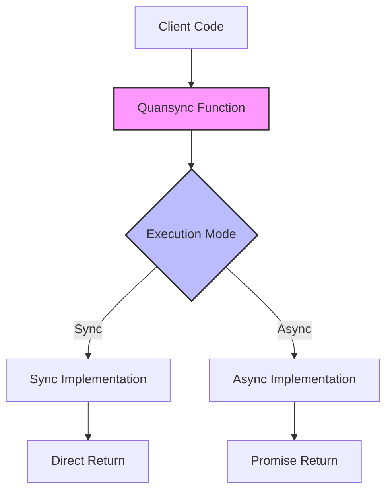
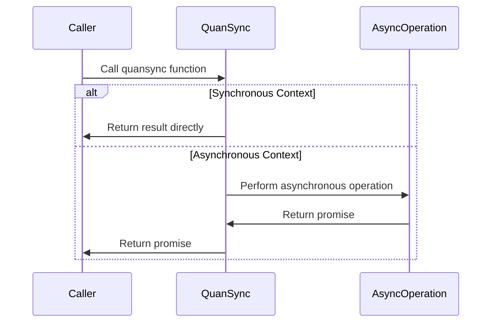
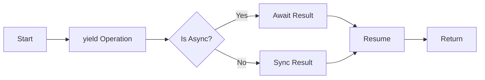
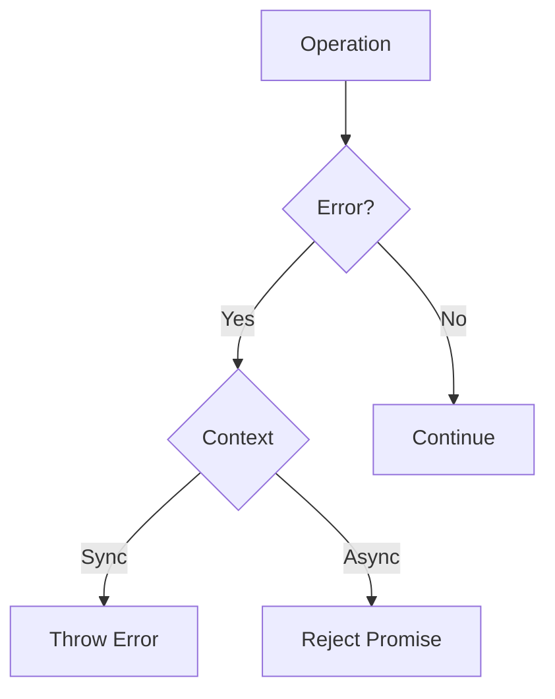
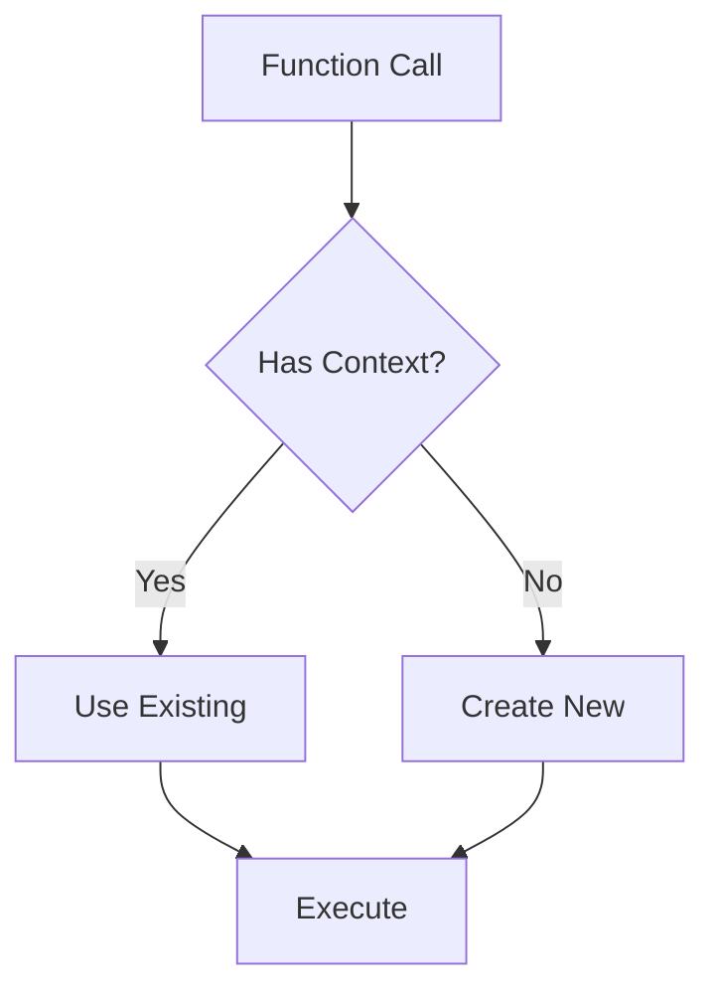
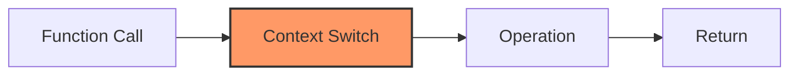
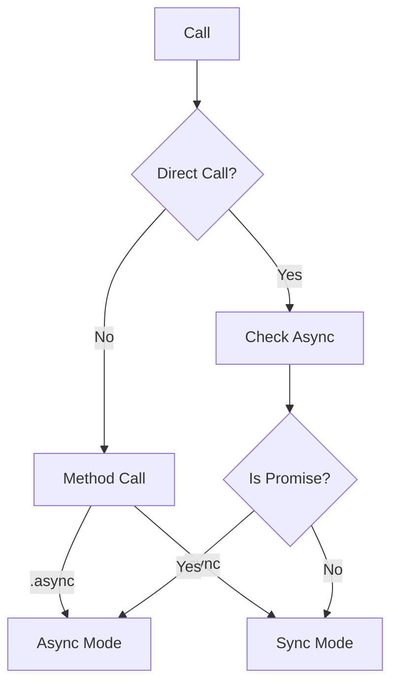
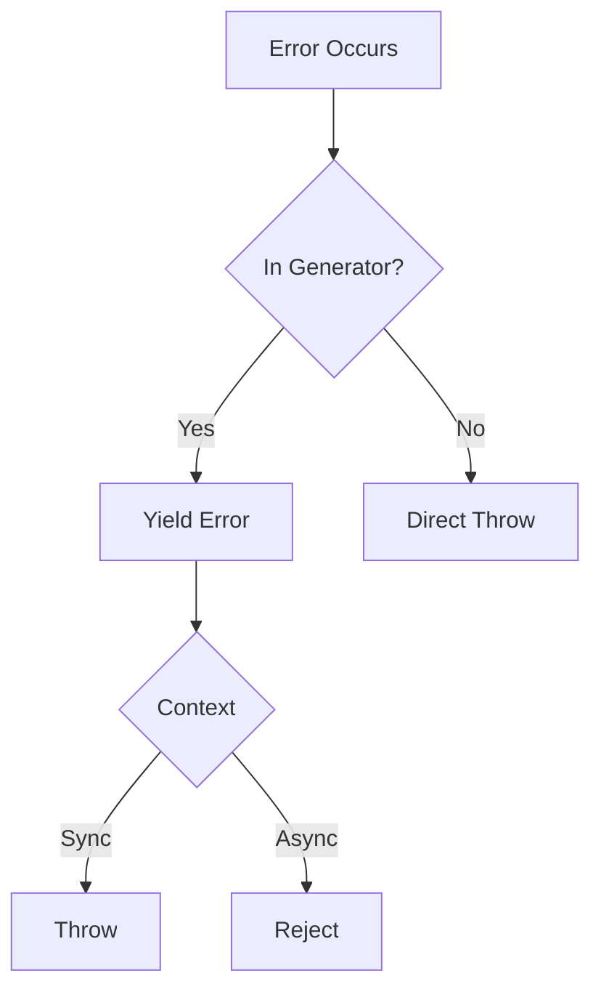

# Core Concepts

## Understanding Quansync {#introduction}

Quansync (Quantum + Sync) creates a "superposition" between synchronous and asynchronous execution modes. This allows functions to operate in either mode depending on how they're called, without requiring different implementations or APIs.

## Architecture Overview {#architecture}



## Execution Flow {#execution-flow}

The sequence diagram below illustrates how Quansync handles function calls in different contexts:



## Key Concepts

### 1. Execution Context {#execution-context}

Quansync maintains awareness of its execution context through the `getIsAsync` utility:

```typescript
const isAsync = yield* getIsAsync()
// Returns: true in async context, false in sync context
```

### 2. Generator Functions {#generator-functions}

Quansync uses generators internally to manage control flow:



### 3. Error Boundaries {#error-boundaries}



## Implementation Details {#implementation}

### Generator Composition {#composition}

Quansync allows composing generator functions:

```typescript
function* outer() {
    const result = yield* inner()  // Composition
    return result
}

function* inner() {
    return yield* someOperation()
}
```

### Context Management {#context-management}



### Promise Handling {#promises}

In synchronous contexts, Quansync prevents promise leaks:

```typescript
const fn = quansync({
    sync: () => {
        // This would throw QuansyncError
        return Promise.resolve(value)
    },
    async: async () => {
        // This is allowed
        return await someAsyncOperation()
    }
})
```

## Type System Integration {#type-system}

Quansync provides strong TypeScript integration:

```typescript
type QuansyncFn<T, Args extends any[]> = {
    (): QuansyncGenerator<T>
    sync: (...args: Args) => T
    async: (...args: Args) => Promise<T>
}
```

## Performance Model {#performance}



Performance overhead is primarily from:
1. Context switching (~150ns per yield)
2. Generator iteration
3. Promise resolution in async mode

## Under the Hood {#internals}

### Context Resolution {#context-resolution}



### Error Propagation {#error-propagation}



## Further Reading

- [Creating Functions](../features/creating-functions.md)
- [Error Handling](../features/error-handling.md)
- [Generator Composition](../features/generator-composition.md)
- [Performance Optimization](./performance.md)