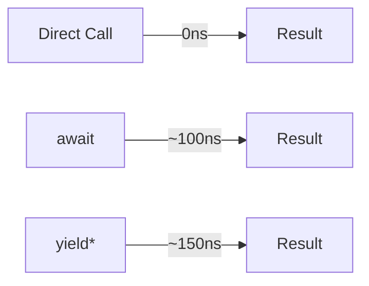

# Quansync Performance Guide

This guide covers performance considerations, optimization techniques, and benchmarking when using Quansync.

## Table of Contents
- [Performance Characteristics](#performance-characteristics)
- [Optimization Techniques](#optimization-techniques)
- [Benchmarking](#benchmarking)
- [Best Practices](#best-practices)

## Performance Characteristics

### Overhead Measurements

- **yield* Operation**: ~150ns per yield
- **Context Switching**: Minimal overhead
- **Memory Usage**: Negligible additional memory usage
- **Type Checking**: Zero runtime cost (TypeScript)

### Performance Comparison



## Optimization Techniques

### 1. Context-Aware Processing

```typescript
const optimizedProcess = quansync(function* (items: any[]) {
  const isAsync = yield* getIsAsync()
  
  if (isAsync && items.length > 1000) {
    // Process in batches when async
    return yield* batchProcess(items)
  } else {
    // Process directly when sync or small dataset
    return yield* directProcess(items)
  }
})
```

### 2. Caching Strategies

```typescript
const createCache = () => {
  const cache = new Map()
  let hits = 0
  let misses = 0
  
  return {
    withCache: quansync(function* (key: string, operation: () => any) {
      if (cache.has(key)) {
        hits++
        return cache.get(key)
      }
      
      misses++
      const result = yield* operation()
      cache.set(key, result)
      return result
    }),
    
    getStats: () => ({ hits, misses, ratio: hits / (hits + misses) })
  }
}
```

### 3. Batch Processing

```typescript
const batchProcessor = quansync(function* (items: any[], batchSize = 100) {
  const isAsync = yield* getIsAsync()
  
  if (isAsync) {
    // Process in parallel batches when async
    const batches = chunk(items, batchSize)
    const results = []
    
    for (const batch of batches) {
      const batchResults = yield* quansync(
        Promise.all(batch.map(item => process.async(item)))
      )
      results.push(...batchResults)
    }
    
    return results
  } else {
    // Process sequentially when sync
    return items.map(item => yield* process(item))
  }
})
```

## Benchmarking

### Running Benchmarks

```bash
# Run complete benchmark suite
pnpm run benchmark

# Run specific benchmark
pnpm run benchmark -- --filter="yield overhead"
```

### Custom Benchmarking

```typescript
import { performance } from 'perf_hooks'

const benchmark = quansync(function* (operation: QuansyncFn, iterations = 1000) {
  const start = performance.now()
  
  for (let i = 0; i < iterations; i++) {
    yield* operation()
  }
  
  const end = performance.now()
  const duration = end - start
  
  return {
    totalTime: duration,
    averageTime: duration / iterations,
    operationsPerSecond: 1000 / (duration / iterations)
  }
})
```

## Best Practices

### 1. Minimize yield* Operations

```typescript
// ❌ Inefficient: Multiple yields
const inefficient = quansync(function* () {
  const a = yield* operation1()
  const b = yield* operation2()
  const c = yield* operation3()
  return [a, b, c]
})

// ✅ Efficient: Single yield for parallel operations
const efficient = quansync(function* () {
  const isAsync = yield* getIsAsync()
  
  if (isAsync) {
    return yield* quansync(Promise.all([
      operation1.async(),
      operation2.async(),
      operation3.async()
    ]))
  } else {
    return [
      operation1.sync(),
      operation2.sync(),
      operation3.sync()
    ]
  }
})
```

### 2. Smart Resource Management

```typescript
const withResourcePool = (poolSize: number) => {
  const pool: Resource[] = []
  
  return quansync(function* (operation: (resource: Resource) => any) {
    const resource = pool.pop() || yield* createResource()
    
    try {
      return yield* operation(resource)
    } finally {
      if (pool.length < poolSize) {
        pool.push(resource)
      } else {
        yield* destroyResource(resource)
      }
    }
  })
}
```

### 3. Optimize for Both Contexts

```typescript
const optimizedIO = quansync({
  sync: (data: Buffer) => {
    // Use synchronous, memory-efficient approach
    return processSync(data)
  },
  async: async (data: Buffer) => {
    // Use asynchronous streaming approach
    const stream = createReadStream(data)
    return processStream(stream)
  }
})
```

## Memory Management

### 1. Buffer Pooling

```typescript
const bufferPool = {
  pool: [] as Buffer[],
  
  acquire: quansync(function* (size: number) {
    return this.pool.pop() || Buffer.alloc(size)
  }),
  
  release: quansync(function* (buffer: Buffer) {
    if (this.pool.length < 1000) {
      this.pool.push(buffer)
    }
  })
}
```

### 2. Streaming Large Data

```typescript
const processLargeData = quansync(function* (path: string) {
  const isAsync = yield* getIsAsync()
  
  if (isAsync) {
    // Use streams in async mode
    return yield* processStream(createReadStream(path))
  } else {
    // Use chunked processing in sync mode
    return yield* processChunked(path)
  }
})
```

## Performance Monitoring

### 1. Operation Timing

```typescript
const withTiming = (operation: QuansyncFn) => {
  return quansync(function* (...args: any[]) {
    const start = performance.now()
    const result = yield* operation(...args)
    const duration = performance.now() - start
    
    console.log(`Operation took ${duration}ms`)
    return result
  })
}
```

### 2. Memory Usage Tracking

```typescript
const trackMemory = (operation: QuansyncFn) => {
  return quansync(function* (...args: any[]) {
    const startMemory = process.memoryUsage()
    const result = yield* operation(...args)
    const endMemory = process.memoryUsage()
    
    console.log('Memory delta:', {
      heapUsed: endMemory.heapUsed - startMemory.heapUsed,
      external: endMemory.external - startMemory.external
    })
    
    return result
  })
}
```

## Next Steps

- Review [Best Practices](./best-practices.md)
- Study [API Reference](./api-reference.md)
- Explore [Generator Composition](./features/generator-composition.md)